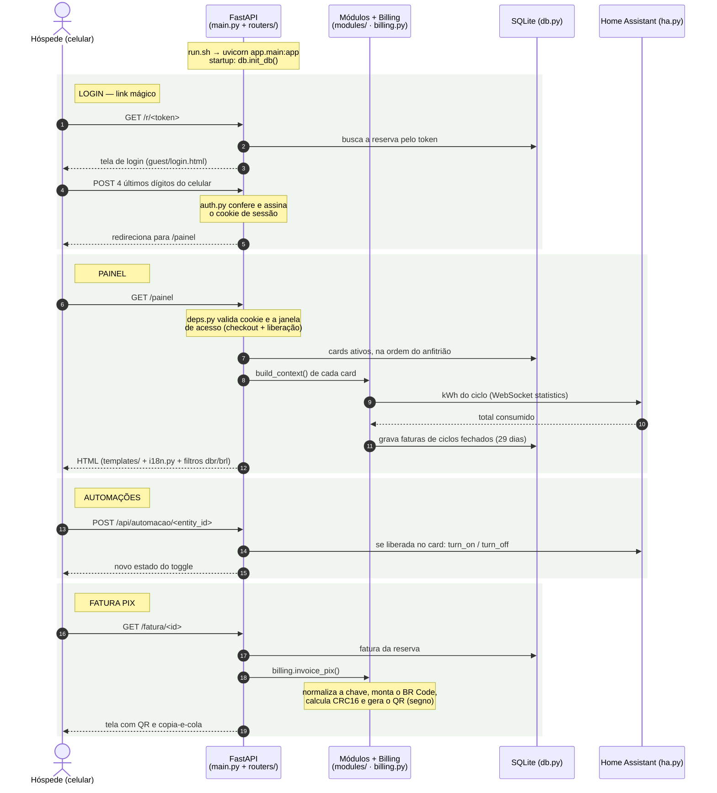

# Arquitetura do Painel do Apartamento

## Visão geral

O ponto de entrada é `painel_apto/run.sh`, que sobe o servidor
`uvicorn app.main:app` na porta 8234. O `app/main.py` monta a aplicação:
registra os filtros de template, os arquivos estáticos e os dois roteadores
(`routers/guest.py` para o hóspede, `routers/host.py` para o anfitrião).
Na inicialização, `db.init_db()` cria as tabelas e os cards padrão.

## Diagrama de sequência

O fluxo do anfitrião é análogo: `routers/host.py` atende `/admin/*`
(login por senha, CRUD de reservas, faturas, configurações e cards).

## Onde modificar cada coisa

| Quero mudar... | Arquivo | O quê |
|---|---|---|
| **Formato de data** (dd-mm-aaaa) | `app/main.py` | função `format_date_br` (filtro `dbr` usado em todos os templates) |
| Formato de moeda (R$) | `app/main.py` | função `format_currency_brl` (filtro `brl`) |
| **Textos e idiomas** (PT/EN/ES) | `app/i18n.py` | dicionário `STRINGS`; para novo idioma, adicione a chave em `LANGS` e o bloco de textos |
| Visual (cores, fontes, espaçamentos) | `app/static/style.css` | variáveis CSS no topo (`:root`) controlam a paleta inteira |
| Comportamento JS do painel | `app/static/painel.js` e função `copyText` no `base.html` | |
| **Criar um card novo** | `app/modules/` + `app/templates/cards/` | 1 arquivo Python com `MODULE = {...}` + 1 template; registre em `modules/__init__.py` |
| Duração do ciclo de fatura (29 dias) | `app/billing.py` | constante `CYCLE_LENGTH_DAYS` |
| Regras do PIX / BR Code | `app/billing.py` | `pix_payload`, `normalize_pix_key`, `invoice_pix` |
| Bloqueio pós check-out / liberação | `app/deps.py` | `access_limit` e `guest_has_access` |
| Tentativas de login do hóspede | `app/routers/guest.py` | `MAX_LOGIN_ATTEMPTS`, `ATTEMPT_WINDOW_MINUTES` |
| Duração das sessões (cookies) | `app/routers/guest.py` e `app/routers/host.py` | constantes `*_MAX_AGE` |
| Telas do hóspede | `app/templates/guest/` e `app/templates/cards/` | |
| Telas do anfitrião | `app/templates/admin/` | |
| Rotas/API do hóspede | `app/routers/guest.py` | |
| Rotas da dashboard do anfitrião | `app/routers/host.py` | |
| Conexão com o Home Assistant | `app/ha.py` | URLs, token, leitura de estatísticas |
| Tabelas do banco | `app/db.py` | constante `SCHEMA` (SQLite em `/data/painel.db`) |
| Configurações editáveis na dashboard | `app/routers/host.py` (`SETTING_KEYS`) + `templates/admin/config.html` | |
| Porta, opções e build do add-on | `painel_apto/config.yaml`, `Dockerfile`, `run.sh` | |

## Regras de negócio principais

- **Ciclo de energia**: do check-in até o 29º dia; a fatura fecha no 30º dia
  (`billing.billing_cycles` / `finished_cycles`). Estadias longas geram um
  ciclo a cada 29 dias; o último fecha no check-out.
- **Acesso do hóspede**: permitido do check-in até o dia do check-out
  (inclusive); bloqueado 1 dia depois, salvo `extended_until` (liberação
  extraordinária definida pelo anfitrião).
- **Segurança**: sessões em cookies httponly assinados com HMAC
  (`auth.py`); senha do anfitrião com PBKDF2; hóspede só alcança automações
  listadas em um card ativo do tipo `automacoes`.
